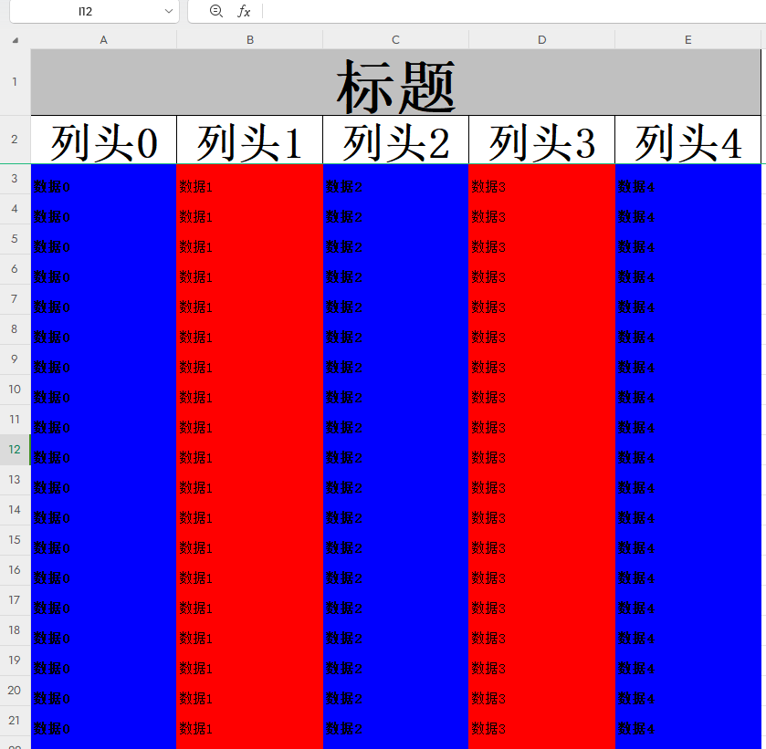

# easy-poi实现动态列(标题)、多sheet导出excel文档等操作
## 项目介绍：
* 提供高度自定义样式Demo参考
* 支持动态列且多sheet导出
* 重新定义样式ExcelExportStyler 实现冻结行、填充表格颜色、加粗、居中、大小等操作
* 封装一个导出工具类，便于调用

## 适用于以下情况
* 表头不固定、不能用注解的形式实现，例如输出答题记录、因为试卷不同、所以题目数量也不同、导致表头数目是不固定的
* 需要输出多个sheet的操作
* 同时需要满足上述两个需求的、需要输出到不同的sheet中、同时表头数目都是不固定的
## 效果如图所示

如果对你有帮助，麻烦点个star哈
(搬运标注原文章出处 谢谢)

